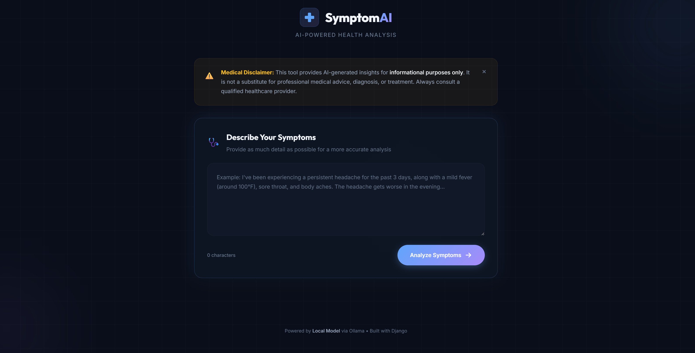

# SymptomAI — Intelligent Health Checker

SymptomAI is an AI-powered symptom checker application built with Django and Ollama. It takes user symptoms as natural language text input and uses the **Granite3.3:2B** language model to predict probable health conditions, assess severity, and recommend next steps. 

It features a modern, responsive, dark-themed UI with glassmorphism effects and real-time inference using a locally hosted LLM.

> **⚠️ Medical Disclaimer:** This tool provides AI-generated insights for *informational purposes only*. It is not a substitute for professional medical advice, diagnosis, or treatment. Always consult a qualified healthcare provider.

---

## Prerequisites

Before you begin, ensure you have the following installed on your system:
1. **Python 3.12+**
2. **[uv](https://github.com/astral-sh/uv)** — Fast Python package installer and resolver.
3. **[Ollama](https://ollama.com/)** — Local LLM runner.

---

## Installation & Setup

### 1. Set Up Ollama and the Model
First, you need to download and run the granite3.3:2b model via Ollama. 

Open a terminal and run:
```bash
# Start the Ollama local server (if not already running in the background)
ollama serve
```

In a separate terminal, pull the model:
```bash
# Pull the granite3.3:2b model (approx. 2.7 GB)
ollama pull granite3.3:2b
```
Wait for the download to complete. You can verify it's available by running `ollama list`.

### 2. Set Up the Django Project
Navigate to the project directory:
```bash
cd samad-project
```

The project uses `uv` for dependency management. Install dependencies and set up the virtual environment by running:
```bash
uv sync
```
*(Alternatively, if running `uv run ...`, uv will automatically build the environment and install the required packages like `django` and `requests` from the `pyproject.toml` or `uv.lock` file).*

### 3. Run Database Migrations
Initialize the local SQLite database:
```bash
uv run python manage.py migrate
```

---

## Running the Application

To run the full stack, you need two processes running simultaneously:

**1. The Ollama Server**
Make sure Ollama is running so the Django backend can communicate with it:
```bash
ollama serve
```

**2. The Django Development Server**
Start the Django frontend and API backend:
```bash
uv run python manage.py runserver
```

Once both are running, open your web browser and navigate to:
**[http://127.0.0.1:8000/](http://127.0.0.1:8000/)**

---

## Usage

1. Open the application in your browser.
2. In the "Describe Your Symptoms" box, type out your symptoms in detail. (e.g., *"I have been experiencing a severe headache, neck stiffness, and a high fever for the past 24 hours."*)
3. Click **Analyze Symptoms**.
4. The backend will package your input, send it to the local granite model via Ollama's Chat API, and stream back the processed JSON.
5. The UI will display:
   - **Overall Assessment:** The analyzed severity (Low, Medium, or High).
   - **Probable Conditions:** Conditions matching your symptoms with likelihood indicators.
   - **Next Steps:** Recommended actionable advice.
6. Your recent analyses will be tracked in the session history at the bottom of the page.

---

## Project Structure

```text
samad-project/
├── pyproject.toml              # uv project configuration
├── manage.py                   # Django management script
├── config/                     # Django core settings
│   ├── settings.py             # Configured with Ollama host + model constants
│   └── urls.py                 # Main URL routing
└── symptom_checker/            # Main application directory
    ├── services.py             # Core logic: Interacts with the Ollama API & parses JSON
    ├── views.py                # Contains the frontend render view and the AJAX API view
    ├── urls.py                 # App-level routing
    ├── templates/
    │   └── symptom_checker/
    │       └── index.html      # Main HTML SPA interface
    └── static/symptom_checker/
        ├── css/style.css       # Premium Dark Theme styling & animations
        └── js/app.js           # Frontend logic (Fetch API, History, DOM updates)
```

## Troubleshooting

- **"Cannot connect to Ollama" / Network Error in UI:** 
  Ensure `ollama serve` is running in a terminal. The backend expects it to be available at `http://localhost:11434`.
- **"No response received" or Timeout Error:**
  Depending on your hardware, running a 2B parameter LLM locally can take some time. The backend timeout is configured for a long threshold (1200s) to accommodate older hardware. Be patient while the "Analyzing..." spinner is active.
- **Model not found:**
  Ensure you ran `ollama pull granite3.3:2b`. Check your `settings.py` if you downloaded a differently tagged model version.
## 📸 Screenshots

